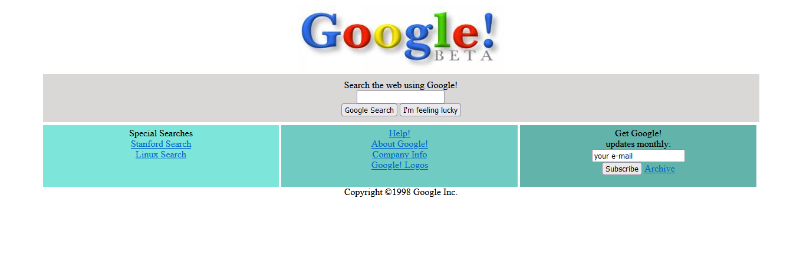

# CSS Ödev-1

Kodluyoruz Eğitimi için CSS konusunda ikinci ödevim.

İnternetteki gelmiş geçmiş bütün web sitelerini görebileceğiniz [Wayback Machine](https://web.archive.org/web/19981202230410if_/http://www.google.com/) adında bir web arşivi bulunmakta. Bu repoda Google 1998 linkinden Google'ın ilk versiyonu nasılmış görebilirsiniz. 

Aşağıdaki ekran görüntüsü benim aslına benzer yapmaya çalıştığım görüntüsüdür. Gerçek sayfada Tablo tasarımı mevcut. Ben DIV kullanarak tasarladım.

## Google Tarihçe
Google 1996 yılında kuruldu ve ilk versiyonunu 1998 yılında yayınladı.
